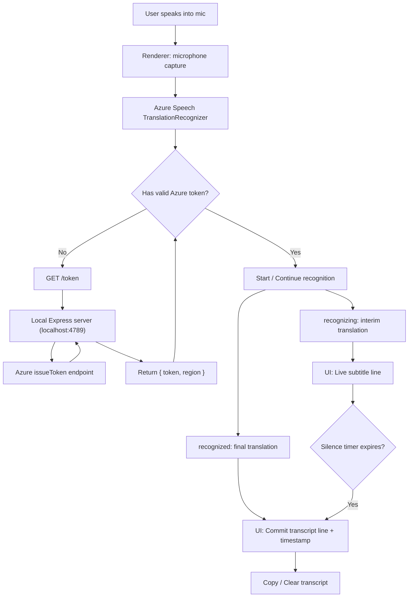
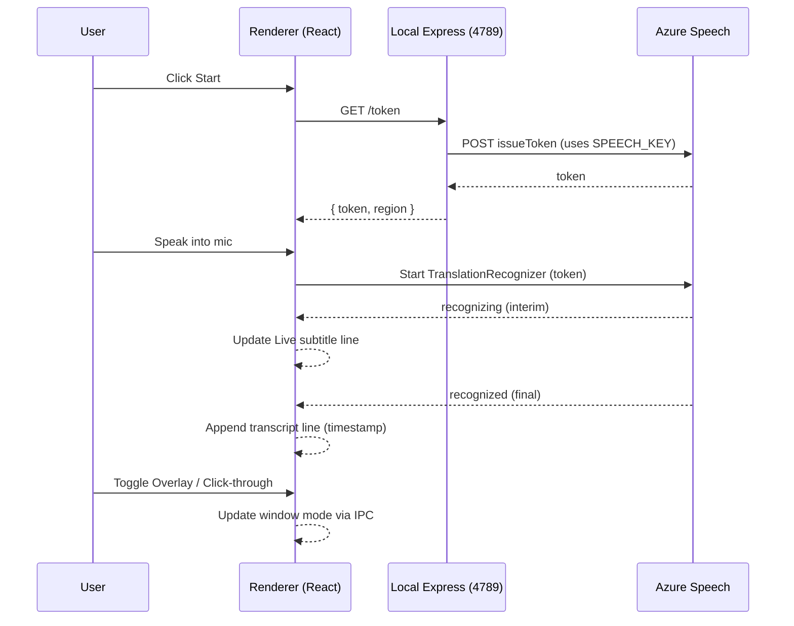

# Real-Time Meeting Translator (Windows)

A Windows desktop companion app that shows **real-time translated subtitles** while you speak — built for demos and for “meeting companion” workflows (Zoom, Google Meet, Teams, etc.).

Built with **Electron + React + TypeScript**, powered by **Azure Speech Translation**.

> **MVP input:** microphone (meeting/system audio capture can be added later).

---

## Demo

- **Normal mode:** full controls + transcript
- **Overlay mode:** compact always-on-top subtitles (optional click-through)

> Tip: Start in Normal mode to configure languages, then toggle Overlay to “float” subtitles over your meeting.

---

## Features

### Core
- **Real-time translation with streaming subtitles** (interim text updates as you speak)
- **Transcript with timestamps** + **Copy** / **Clear**
- **Translate between any two supported languages** (pick source + target)
- **Low-latency UX**: live line for interim text, transcript for finalized lines

### Nice UX (for a strong demo)
- **Overlay toggle** (single window switches mode)
  - Overlay is **frameless + always-on-top**
  - Optional **click-through** overlay (“ghost mode”)
- **Copy transcript** to clipboard
- **Clear transcript**
- **Status badge**: Idle / Listening / Translating / Error
- **Global hotkeys**
  - `Ctrl+Shift+S` — Start / Stop
  - `Ctrl+Shift+D` — Overlay toggle

### Bonus
- **Silence commit + punctuation**
  - If you pause for ~`SILENCE_MS`, the current live line is committed
  - If it doesn’t end with punctuation, the app appends a `.`

---

## How it works (high-level)

1. The **renderer (React)** captures microphone audio and runs the Azure Speech Translation recognizer.
2. The app uses a **local Express server** (inside Electron main process) on **`http://localhost:4789`**:
   - `GET /health` → sanity check
   - `GET /token` → returns `{ token, region }`
3. The renderer uses this short-lived token to talk to Azure Speech — your Azure key never touches the UI.

---

## Tech stack

### Desktop app
- **Electron** (main process): window management (Normal ↔ Overlay), global shortcuts, IPC, local Express server
- **React + Vite + TypeScript** (renderer): UI, state, subtitle rendering, mic permission flow
- **Express** (local API): mints short-lived Azure auth tokens (`/token`) and provides health checks (`/health`)

### Speech / translation
- **Azure Speech Translation** via **Azure Speech SDK** (JavaScript)
  - Streaming events (`recognizing` for interim updates, `recognized` for finalized lines)
  - Optional auto source-language detection (from a candidate locale list)

### Build & tooling
- **electron-builder** (packaging)
- **npm scripts** for dev/build/pack/dist
- Optional: **ESLint/Prettier** (recommended if you want consistent formatting)

---

## Configuration

### Environment variables

The app expects these at runtime (recommended approach):

| Variable | Example | Where used | Notes |
|---|---|---|---|
| `SPEECH_KEY` | `xxxxxxxxxxxxxxxx` | Electron main (Express) | Azure Speech subscription key (never exposed to renderer) |
| `SPEECH_REGION` | `eastus` / `centralindia` | Electron main (Express) | Must match your Azure Speech resource region |

> Tip (Windows): set env vars in the same terminal where you run `npm run dev`, or configure them in your packaged app launch environment.

### Local endpoints (inside the app)

The Electron main process starts a local server (default port `4789`):

| Endpoint | Purpose | Response |
|---|---|---|
| `GET /health` | sanity check | `{ "ok": true }` |
| `GET /token` | Azure token minting | `{ "token": "...", "region": "..." }` |

### IPC channels (renderer ↔ main)

These channels are typically used for desktop-specific behavior:

| Channel | Direction | Purpose |
|---|---|---|
| `ui:setMode` | renderer → main | Toggle `normal` / `overlay` window mode |
| `ui:modeChanged` | main → renderer | Notify renderer of the current mode |
| `ui:setClickThrough` | renderer → main | Enable/disable click-through in overlay mode |

(Names may differ slightly depending on your implementation—keep this table in sync with your code.)

---

## Project design notes

### Why a local token server?
- Keeps **Azure subscription keys** out of the renderer process.
- Renderer uses a **short-lived token**, reducing the risk if someone inspects UI code.
- Makes it easier to swap providers later (Deepgram, Whisper, etc.) behind the same `/token` interface.

### Why a single-window overlay toggle?
- Fewer state sync issues than managing two windows.
- Overlay feels “product-like” while staying simple to maintain.
- Great for demos: configure in Normal mode, then float subtitles above your meeting window.


## Repository structure (typical)

```text
app/
  electron/
    main.ts          # Electron main process (window + Express server)
    preload.ts       # Safe IPC bridge to renderer
  src/
    App.tsx          # UI (normal + overlay layout)
    hooks/
      useTranslator.ts  # Start/stop + recognizer wiring
  package.json
  README.md
```

---

## Prerequisites

- **Windows 10/11**
- **Node.js 18+**
- An **Azure Speech** resource with:
  - `SPEECH_KEY`
  - `SPEECH_REGION` (example: `eastus`, `centralindia`, etc.)

---

## Quick start (Development)

### 1) Install dependencies
```bash
git clone <your-repo-url>
cd RealTime_Meet_Translator/app
npm install
```

### 2) Set Azure environment variables

**PowerShell (current session):**
```powershell
$env:SPEECH_KEY="your_azure_key"
$env:SPEECH_REGION="your_region"
```

**Git Bash (current session):**
```bash
export SPEECH_KEY="your_azure_key"
export SPEECH_REGION="your_region"
```

### 3) Run dev
```bash
npm run dev
```

### 4) Verify the local API (optional but recommended)
```bash
curl http://localhost:4789/health
curl http://localhost:4789/token
```

Expected:
- `/health` → `{"ok":true}`
- `/token` → `{"token":"...","region":"..."}`

---

## Usage

1. Choose **Speaker Language**  
   - Use **Auto Detect** (if enabled) or select a specific locale like `hi-IN`, `es-ES`, etc.
2. Choose **Translate To** (default: English).
3. Click **Start** (or press `Ctrl+Shift+S`).
4. Speak into your microphone.
   - The **live line** updates during speech (interim).
   - The app commits finalized lines into the **transcript** (final).
5. Toggle **Overlay** (or `Ctrl+Shift+D`) to float subtitles above your meeting window.
6. Use **Copy transcript** when you’re done.

---

## Overlay mode tips (Windows)

- **Click-through**: when enabled, mouse clicks go through the overlay to the window behind it.  
  Turn it off if you want to click Start/Stop from the overlay.
- If the overlay appears black/non-transparent:
  - Some environments (RDP/Citrix) disable transparency.

---

## Building for Windows

Common scripts (check `package.json` in your repo):

| Command | Result |
|---|---|
| `npm run build` | Build renderer + Electron (no packaging) |
| `npm run pack` | Create an unpacked build folder |
| `npm run dist` | Build a distributable (installer/portable depending on config) |
| `npm run dist:win` | Windows portable build (requires env vars at runtime) |
| `npm run dist:embedded` | Demo-only build with embedded credentials (**do not publish**) |

### Standard build (recommended)
```bash
npm run dist:win
```
Set `SPEECH_KEY` + `SPEECH_REGION` before launching the `.exe`.

### Embedded build (**demo only**)
```bash
npm run dist:embedded
```

⚠️ **Security warning:** Embedded builds contain your Azure key inside the executable. Never publish or share these publicly.

---

## Performance & latency

This app is designed for **minimal perceived latency** by:
- Rendering **interim** subtitles from `recognizing` events (fast feedback)
- Committing **final** lines from `recognized` events (clean transcript)
- Optional “silence commit” to finalize the current line when the speaker pauses

### Practical tips
- Use a good microphone and reduce background noise (improves stability of interim updates)
- Keep your auto-detect locale list small (5–10) for better accuracy and responsiveness
- If the UI feels “jumpy”, increase `SILENCE_MS` slightly (e.g., 900–1200ms)

---

## Troubleshooting

### No microphone input / permission issues
- Windows Settings → **Privacy & security** → **Microphone**
  - Enable microphone access
  - Enable access for **desktop apps**
- Verify the default input device:
  - Windows Settings → System → Sound → Input

### `/token` fails
- Confirm `SPEECH_KEY` and `SPEECH_REGION` are correct.
- Ensure the port isn’t taken:
  - If another process uses `4789`, close it and restart the app.

### Translation starts but no text appears
- Speak a bit longer (interim events can be sparse on very short utterances)
- Try a different language pair (e.g., `hi-IN` → `en-US`)
- Check DevTools console for recognizer errors

---

## Mermaid diagrams

### Flowchart: end-to-end runtime


### Sequence diagram


---

## Roadmap (suggested next upgrades)

- Speaker diarization (“who spoke when”)
- Export transcript as `.txt` / `.srt`
- Optional speech-to-speech output (TTS)

---

## Security notes

- **Do not embed** `SPEECH_KEY` in the renderer.
- If you use an “embedded credentials” build for demos, treat it as **private** and never publish it publicly.
- Tokens from `/token` are short-lived; restarting the app will fetch a fresh token.

---

## License

MIT
